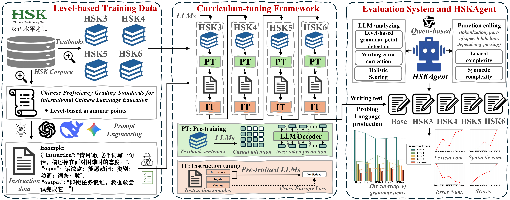

# HSKBenchmark
HSKBenchmark: Modeling Chinese Second Language Acquisition in Large Language Models through Curriculum Tuning (submitted to AAAI26 AI for Social Impact)

[](https://huggingface.co/CharlesYeung001/HSKBenchmark_adapters/tree/main)

### Abstract
Language acquisition is vital to reveal the nature of human language intelligence and has recently emerged as a promising lens for improving the interpretability of large language models (LLMs). However, due to ethical and practical constraints, many experiments requiring language input control remain infeasible with human learners. This poses challenges for the verifiability and scalability of language acquisition modeling, particularly in Chinese second language acquisition (SLA). While LLMs provide a controllable and reproducible alternative, a systematic benchmark to support phase-wise modeling and assessment is still lacking. To address these issues, we propose HSKBenchmark, the first benchmark for staged modeling and writing assessment of LLMs in Chinese SLA. It spans HSK levels 3 to 6, comprising authentic textbooks with 6.76M tokens, 16K synthetic instruction data, 30 test titles and a linguistically-grounded evaluation system. To simulate human acquisition trajectories, a curriculum-tuning framework is introduced, which trains LLMs in a progression from beginner to advanced materials. In addition, since language production in writing is a key perspective for observing SLA development, we establish the evaluation system including the coverage of level-based grammar items, writing errors, lexical complexity, syntactic complexity, and holistic scoring to probe LLMs in writing. We also develop an HSKAgent fine-tuned on 10K compositions from Chinese second language learners to automate this evaluation system. Extensive experimental results demonstrate that HSKBenchmark not only models Chinese SLA effectively, but also serves as a reliable benchmark for dynamic writing assessment in LLMs. Our fine-tuned LLMs have writing performance on par with advanced human learners and exhibit human-like acquisition characteristics. The HSKBenchmark, HSKAgent, and checkpoints serve as foundational tools and resources, paving the way for future research on language acquisition modeling and LLMs interpretability.

#### Illustration of HSKBenchmark:

---

### Preface
Part of our project is developed based on the [LLaMA-Factory](https://github.com/hiyouga/LLaMA-Factory) framework. It is highly recommended to familiarize yourself with this framework prior to engaging in our project, as it provides a easy and efficient LLM fine-tuning toolkit.

### Setting and Environment
Our code is implemented on Pytorch 2.6.0 and 3 RTX 3090 GPUs (24G). 
To reproduce our experiments, please run: 
```.
cd codes
pip install -r requirements.txt
```
### 1. USAGE
#### Download data: 
Datasets | Source
--- | :---:
Checklist of textbooks | [Link](https://github.com/CharlesYang030/HSKB/blob/main/data/pretraining_data/textbook_checklist.xlsx)
Textbooks | [Link](https://github.com/CharlesYang030/HSKB/tree/main/data/pretraining_data/pretrain-data)
Level-based Pretaining data | [Link](https://github.com/CharlesYang030/HSKB/tree/main/data/pretraining_data) or  [🤗](https://huggingface.co/datasets/CharlesYeung001/Curriculum_Tuning_Training_Data)
Checklist of grammar items | [Link](https://github.com/CharlesYang030/HSKB/blob/main/data/grammar_instruction_data/grammar_items/HSK_grammar_items_selected_collection.xlsx)
Grammar items data | [Link](https://github.com/CharlesYang030/HSKB/tree/main/data/grammar_instruction_data/grammar_items) or  [🤗](https://huggingface.co/datasets/CharlesYeung001/Curriculum_Tuning_Training_Data)
Level-based instruction data | [Link](https://github.com/CharlesYang030/HSKB/tree/main/data/grammar_instruction_data/level_based_sft_data) or  [🤗](https://huggingface.co/datasets/CharlesYeung001/Curriculum_Tuning_Training_Data)
Training data for HSKAgent | [🤗](https://huggingface.co/datasets/CharlesYeung001/Curriculum_Tuning_Training_Data)
Writing titles | [Link](https://github.com/CharlesYang030/HSKB/blob/main/codes/data/writing_test_data.json)

#### Download LLMs: 
Models | Link
--- | :---:
Llama2-7B-Chat | [Download from official website](https://www.llama.com/llama2/)
Mistral-7B-Instruct-v0.3 | [Download from official website](https://huggingface.co/mistralai/Mistral-7B-Instruct-v0.3)
Chinese-Alpaca-2-7B | [Download from official website](https://huggingface.co/hfl/chinese-alpaca-2-7b)
Qwen3-8B | [Download from official website](https://huggingface.co/Qwen/Qwen3-8B)

#### Data preparation:
After downloading the level-based pretraining data, please unzip the folder and put all files into `code/data` as follow:
```.
(this project)
|—— LLM-generation
|—— ...
|—— code
|    |—— data
|         |—— dataset_info.json
|         |—— pretraining_data_3.json
|         |—— pretraining_data_4.json
|         |—— pretraining_data_5.json
|         |—— pretraining_data_6.json
|         |—— grammar_sft_3level.json
|         |—— grammar_sft_4level.json
|         |—— grammar_sft_5level.json
|         |—— grammar_sft_6level.json
|         |—— writing_test_data.json
|         |—— ...
|    |—— scripts
|    |—— src
|    |—— ...
```

#### Curriculum tuning in LLMs:
Launch webui of LLaMA-Factory:
```.
cd codes
llamafactory-cli webui
```
##### For the detailed step-by-step operation of training and inference, please refer to LLaMA-Factory.

Then, please select a target base LLM and a piece of the level-based data to start the curriculum tuning framework.

After staged modeling, please let the fine-tuned LLM complete the writing task using the writing_test_data.json (prediction mode).

#### Our open-source materials:

(1) The compositions written by these baseline LLMs and their final testing data for grammar detection, error correction, and holistic scoring are released at [🤗](https://huggingface.co/datasets/CharlesYeung001/Curriculum_Tuning_Test_Data).

(2) The compositions written by human learners, all error types, and the error processing guideline are released at [🤗](https://huggingface.co/datasets/CharlesYeung001/Writing_and_Errors)

(3) All staged adapters of the curriculum-tuned LLMs are release at [🤗](https://huggingface.co/CharlesYeung001/HSKBenchmark_adapters). Please merge them with the base model step by step into checkpoints at each stage.

#### TODO list:
Release the online platform of HSKAgent

---

### Acknowledgement
HSKBenchmark benifits from [LLaMA-Factory](https://github.com/hiyouga/LLaMA-Factory). The original authors and their open-sourcing are appreciated.
